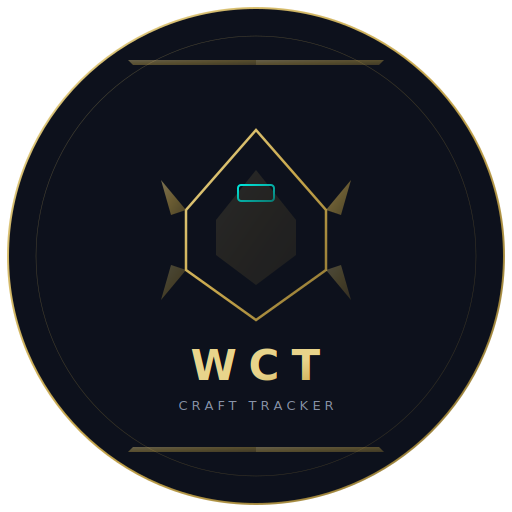
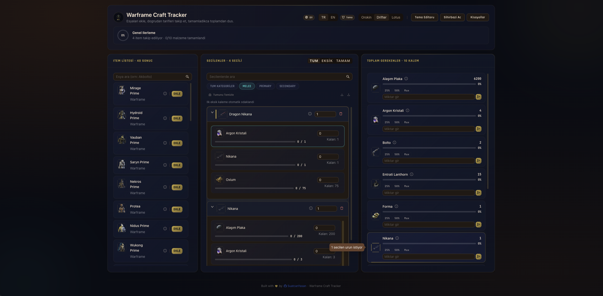

<p align="center">
  
</p>

<h1 align="center">Warframe Craft Tracker</h1>

<p align="center">
  <strong>Track crafting requirements, manage resources, and never lose progress.</strong>
</p>

<p align="center">
  
  
  
  
  
  
</p>

<p align="center">
  
</p>

---

## Features

- **Craft Requirement Calculator** — Add any craftable item, see all required resources with quantities
- **Completion Tracking** — Mark resources as collected, track progress per-item and overall
- **Bulk Donate** — Enter a resource amount and auto-distribute across all items that need it (25% / 50% / Max quick-fill)
- **Drop Location Info** — Click the info icon on any item or resource to see where it drops, with rarity and chance percentages
- **Turkish & English** — Full localization for both UI and in-game item names (Warframe official translations)
- **Auto Language Detection** — Detects browser language on first visit
- **3 Theme Presets** — Orokin (dark gold), Drifter (warm brown), Lotus (light blue)
- **Full Theme Customization** — Color picker for 10+ tokens, save/load profiles, export/import JSON
- **Resizable Panels** — Drag column borders to resize the three panels
- **Draggable Panel Order** — Rearrange panels via drag & drop
- **Export / Import** — Backup selected items and progress as JSON, restore anytime
- **Keyboard Shortcuts** — `/` to search, `Arrow` keys to navigate, `Delete` to remove, `?` for help
- **Desktop App** — Native Electron app with file-based persistence
- **Responsive** — Works on mobile, tablet, and desktop
- **Glassmorphism UI** — Warframe-inspired Orokin aesthetic with gold accents, noise texture, and glow effects

## Quick Start

### Prerequisites

- [Node.js](https://nodejs.org/) v18 or later

### Install & Run

```bash
# Clone the repository
git clone https://github.com/SuatcanYasan/warframe-item-tracker.git
cd warframe-item-tracker

# Install dependencies
npm install

# Download item database snapshot (optional, for offline support)
npm run snapshot

# Start development server
npm run dev
```

Open **http://localhost:5174** in your browser.

### Production Build

```bash
# Build frontend + start server
npm run easy
```

### Desktop App (Electron)

```bash
# Build and launch desktop app
npm run desktop

# Build portable Windows executable
npm run desktop:pack
```

## Architecture

```
warframe-item-tracker/
├── src/                          # Backend (Express)
│   ├── server.js                 # REST API server
│   └── services/
│       ├── itemsService.js       # WFCD data fetching, caching, i18n
│       └── craftCalculator.js    # Craft requirement engine
├── web/                          # Frontend (React + Vite)
│   └── src/
│       ├── App.jsx               # Main app orchestrator
│       ├── components/           # UI components
│       │   ├── Header.jsx        # App header + progress overview
│       │   ├── SearchPanel.jsx   # Item search with live results
│       │   ├── SelectedPanel.jsx # Selected items + requirements
│       │   ├── TotalsPanel.jsx   # Aggregated totals + bulk donate
│       │   ├── ThemeDrawer.jsx   # Theme customization
│       │   ├── DropInfoPopover.jsx # Drop location info
│       │   └── Footer.jsx        # App footer
│       ├── hooks/                # Custom React hooks
│       │   ├── useItemI18n.js    # Game item translation
│       │   └── useResizablePanels.js # Resizable column layout
│       ├── constants/            # i18n strings, theme presets
│       └── utils/                # Storage, helpers
├── desktop/                      # Electron app
│   ├── main.cjs                  # Main process
│   └── preload.cjs               # IPC bridge
├── scripts/
│   └── build-items-snapshot.mjs  # Offline data snapshot builder
└── data/                         # Cached item database (~36MB)
```

## API Endpoints

| Method | Endpoint | Description |
|--------|----------|-------------|
| `GET` | `/api/health` | Health check |
| `GET` | `/api/items?search=&limit=` | Search craftable items |
| `POST` | `/api/items/resolve-metadata` | Batch resolve item metadata |
| `GET` | `/api/items/drops/:uniqueName` | Get drop locations for an item |
| `GET` | `/api/i18n?lang=tr` | Get translated item names |
| `POST` | `/api/calculate` | Calculate craft requirements |

## Data Source

Item data is sourced from the [Warframe Community Data (WFCD)](https://github.com/WFCD/warframe-items) project, which provides comprehensive Warframe item data including:

- All craftable items with recipes
- Drop locations and chances
- Translations for 14 languages
- Item images via CDN

## Tech Stack

| Layer | Technology |
|-------|-----------|
| Frontend | React 18, Ant Design 5, Vite 5 |
| Backend | Express 4, Node.js 18+ |
| Desktop | Electron 31 |
| Styling | CSS Custom Properties, Glassmorphism |
| Data | WFCD warframe-items (GitHub CDN) |
| Fonts | Rajdhani, Inter, JetBrains Mono |

## npm Scripts

| Script | Description |
|--------|-------------|
| `npm run dev` | Start dev server (backend + Vite) |
| `npm run build` | Build frontend for production |
| `npm run easy` | Build + start production server |
| `npm run snapshot` | Download item database snapshot |
| `npm run desktop` | Build + launch Electron app |
| `npm run desktop:pack` | Build portable Windows executable |
| `npm test` | Run test suite |

## Keyboard Shortcuts

| Key | Action |
|-----|--------|
| `/` | Focus search input |
| `Enter` | Search |
| `Arrow Up/Down` | Navigate selected items |
| `Delete` | Remove active selected item |
| `?` | Show shortcuts dialog |

## Contributing

1. Fork the repository
2. Create a feature branch (`git checkout -b feature/amazing-feature`)
3. Commit your changes (`git commit -m 'Add amazing feature'`)
4. Push to the branch (`git push origin feature/amazing-feature`)
5. Open a Pull Request

## License

This project is open source. Warframe is a registered trademark of Digital Extremes Ltd. This project is not affiliated with or endorsed by Digital Extremes.

## Author

**SuatcanYasan** — [GitHub](https://github.com/SuatcanYasan)

---

<p align="center">
  
  <br/>
  <sub>Built with Orokin precision</sub>
</p>
