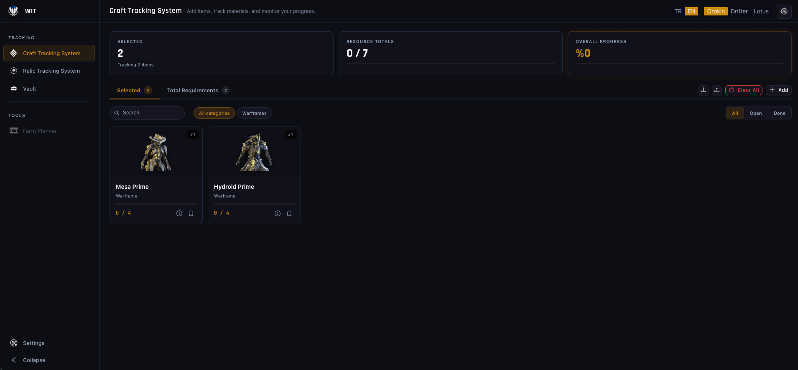

<div align="center">


# Warframe Item Tracker

**Craft, void relic ve prime parça envanteri için modern, tema duyarlı, PWA destekli takip uygulaması.**

[English](./README.md) · [Türkçe](./README.tr.md)

[](https://react.dev)
[](https://vitejs.dev)
[](https://ant.design)
[](https://zustand-demo.pmnd.rs)
[](https://tanstack.com/query)
[](https://www.i18next.com)
[](https://web.dev/progressive-web-apps/)
[](https://nodejs.org)
[](#lisans)

<p align="center">
  
</p>

</div>

---

## İçindekiler

- [Genel Bakış](#genel-bakış)
- [Özellikler](#özellikler)
- [Klavye Kısayolları](#klavye-kısayolları)
- [Hızlı Başlangıç](#hızlı-başlangıç)
- [Kullanım](#kullanım)
- [Teknoloji Yığını](#teknoloji-yığını)
- [Proje Yapısı](#proje-yapısı)
- [Script'ler](#scriptler)
- [Sorun Giderme](#sorun-giderme)
- [Yol Haritası](#yol-haritası)
- [Lisans](#lisans)

---

## Genel Bakış

**WIT (Warframe Item Tracker)**, Warframe için production seviye bir yardımcı uygulamadır. Neyi craftlamak istediğini, hangi void relic'lerin ihtiyacın olan prime parçaları düşürdüğünü ve envanterinde neyin hazır beklediğini tek bir yerde takip etmene yardım eder — hesap gerektirmez.

**Progressive Web App (PWA)** olarak tasarlandı: tarayıcıdan doğrudan kurabilir, ilk yüklemeden sonra offline çalışır, ve craft ilerlemen ile relic takibini iki yönlü senkronize eden bir sistem içerir.

Tüm veriler tarayıcının localStorage'ında kalır. Telemetri yok, sunucu tarafında hesap yok, kayıt yok.

---

## Özellikler

### Ana Sayfalar

| Sayfa | Ne yapıyor |
|-------|------------|
| **Craft Takip Sistemi** | Üretmek istediğin item'ları ekle, her kaynak gereksinimini gör, öncelik sırasına göre sürükle-bırak sırala, malzemeleri topladıkça işaretle, görsel donut grafiği ile genel ilerlemeyi takip et |
| **Relic Takip Sistemi** | Her prime parçayı hangi void relic'lerin düşürdüğünü gör, bulunan bileşenleri işaretle, Craft Takip ile iki yönlü otomatik senkronize olur |
| **Vault** | Sahip olduğun tek tek prime parçaları ekle, hangi setleri tamamlayabileceğini gör, card ve sıralanabilir tablo görünümü arasında geçiş yap |

### Kullanıcı Deneyimi

- **Kurulum Sihirbazı** — Çok adımlı ilk açılış onboarding'i (hoşgeldin → dil → tema → hazır), animasyonlu geçişler ve canlı tema önizleme
- **Üç Tema** — Orokin (altın), Drifter (yeşil), Lotus (açık mavi) — ikonlar dahil her UI öğesi dinamik uyum sağlar
- **Tema Editörü** — Kendi renk şemanı oluştur, birden fazla profil kaydet, JSON olarak dışa/içe aktar
- **İki Dilli** — i18next ile tam Türkçe ve İngilizce, anında geçiş
- **Sürükle & Bırak** — Takip edilen item'ları öncelik sırasına göre yeniden sırala (@dnd-kit)
- **Fuzzy Arama** — Yazım hataları sorun değil (Fuse.js)
- **Klavye Kısayolları** — Fareye dokunmadan gezin, ara, sayfa değiştir
- **Donut İlerleme Grafiği** — Summary bar'da görsel tamamlanma göstergesi (recharts)
- **Göreli Zaman Damgaları** — Her takip edilen item'da "2 saat önce eklendi" (dayjs)
- **Ekran Görüntüsü Dışa Aktarma** — Tek tıkla PNG olarak mevcut görünümü dışa aktar (html-to-image)
- **Toast Bildirimleri** — Modern, tema duyarlı toast'lar (react-hot-toast)
- **İki Yönlü Senkron** — Craft Takip'te bir parçayı tamamla, Relic Takip'te otomatik bulunmuş işaretlenir
- **İçe/Dışa Aktarma** — Verini JSON olarak yedekle, cihazlar arası taşı

### Teknik

- **PWA** — Desktop/mobile uygulama olarak kurulabilir, service worker cache'i ile offline çalışır
- **Zustand Store'ları** — 4 alan store'u (app, craft, relic, inventory) — Redux boilerplate'i yok
- **React Query** — 5 dakikalık stale time ile API cache'i, arka plan yenileme
- **Virtualization Hazır** — Büyük listeler için @tanstack/react-virtual mevcut
- **Tip Güvenli Storage** — Geriye dönük uyumlu localStorage normalizasyonu
- **Her Şey Tema Duyarlı** — Tüm renkler CSS custom properties ve `color-mix()` kullanır

---

## Klavye Kısayolları

Herhangi bir yerde `?` tuşuna basarak tam listeyi gör.

| Kısayol | Eylem |
|---------|-------|
| <kbd>Ctrl</kbd> + <kbd>K</kbd> / <kbd>⌘</kbd> + <kbd>K</kbd> | Arama drawer'ını aç |
| <kbd>/</kbd> | Arama drawer'ını aç |
| <kbd>1</kbd> | Craft Takip Sistemi'ne git |
| <kbd>2</kbd> | Relic Takip Sistemi'ne git |
| <kbd>3</kbd> | Vault'a git |
| <kbd>?</kbd> | Klavye kısayollarını göster |
| <kbd>Esc</kbd> | Modal kapat |

Header'da özel bir `⌘K` pill'i, tıklanabilir erişim için kısayol yardım modalını açar.

---

## Hızlı Başlangıç

### Gereksinimler

- [Node.js 18+](https://nodejs.org) — LTS önerilir

### Windows

**`start.bat`** dosyasına çift tıkla

### macOS / Linux

```bash
./start.sh
```

İlk çalıştırmada script şunları yapar:
1. npm paketlerini kurar (2-3 dakika)
2. Arayüzü derler
3. Backend server'ı başlatır
4. Tarayıcında **http://localhost:3444** adresini açar

Sonraki açılışlar anında olur. Durdurmak için terminalde `CTRL+C` bas.

### Desktop Uygulaması Olarak Kur (PWA)

1. Chrome, Edge veya Brave'de `http://localhost:3444` adresini aç
2. Adres çubuğundaki kurulum ikonuna tıkla (veya menü → "Warframe Item Tracker'ı Yükle")
3. Uygulama kendi penceresinde açılır, başlat menünde/dock'ta görünür ve offline çalışır

---

## Kullanım

### Craft Takip Sistemi

1. **Ekle** butonuna tıkla veya <kbd>Ctrl</kbd>+<kbd>K</kbd> bas
2. Bir item ara (örn: *"Mesa Prime"*)
3. Card'a tıklayıp gereksinimlerini gör
4. Her malzeme için sahip olduğun miktarı gir
5. **Toplam Gerekenler** sekmesi tüm takip edilen item'ların toplam malzemelerini gösterir
6. **Card'daki handle'ı sürükle** ve önceliğe göre yeniden sırala

### Relic Takip Sistemi

- Craft Takip'e eklediğin prime item'lar burada otomatik görünür
- Bir card'a tıklayıp her bileşeni hangi relic'lerin düşürdüğünü gör
- Bileşenleri bulundu olarak işaretle — Craft Takip eşzamanlı güncellenir

### Vault

1. **Parça Ekle** drawer'ını aç
2. Tek tek prime bileşenleri ara (örn: *"Ash Neuroptics"*)
3. Miktarı gir
4. **Setler** sekmesine geçip hangi tam prime setlerini yapabileceğini gör
5. **Card** ve **Tablo** görünümleri arasında geçiş yap

---

## Teknoloji Yığını

### Frontend

| Kategori | Kütüphaneler |
|----------|--------------|
| **Framework** | [React 18](https://react.dev), [Vite 5](https://vitejs.dev), [React Router 7](https://reactrouter.com) |
| **UI** | [Ant Design 5](https://ant.design), [@ant-design/icons](https://ant.design/components/icon) |
| **State** | [Zustand](https://zustand-demo.pmnd.rs), [Immer](https://immerjs.github.io/immer/) |
| **Veri Çekme** | [TanStack Query](https://tanstack.com/query), [TanStack Virtual](https://tanstack.com/virtual), [TanStack Table](https://tanstack.com/table) |
| **Arama** | [Fuse.js](https://fusejs.io) (fuzzy) |
| **Animasyon** | [Framer Motion](https://www.framer.com/motion/), [@formkit/auto-animate](https://auto-animate.formkit.com) |
| **Sürükle & Bırak** | [@dnd-kit/core](https://dndkit.com), [@dnd-kit/sortable](https://dndkit.com) |
| **Grafik** | [Recharts](https://recharts.org) |
| **i18n** | [i18next](https://www.i18next.com), [react-i18next](https://react.i18next.com) |
| **Tarih** | [Day.js](https://day.js.org) |
| **Bildirim** | [react-hot-toast](https://react-hot-toast.com) |
| **Kısayol** | [hotkeys-js](https://github.com/jaywcjlove/hotkeys-js) |
| **Dışa Aktarma** | [html-to-image](https://github.com/bubkoo/html-to-image) |
| **PWA** | [vite-plugin-pwa](https://vite-pwa-org.netlify.app) |

### Backend

- **[Express 4](https://expressjs.com)** — HTTP server & API
- **[WFCD warframe-items](https://github.com/WFCD/warframe-items)** — Resmi Warframe verisi
- **[Node.js 18+](https://nodejs.org)** — Runtime

---

## Proje Yapısı

```
warframe-item-tracker/
├── src/                          Backend
│   ├── server.js                 Express API
│   └── services/
│       ├── itemsService.js       WFCD data loader + arama
│       └── craftCalculator.js    Gereksinim çözücü
├── web/
│   ├── src/
│   │   ├── App.jsx               Kök + routing + klavye kısayolları
│   │   ├── i18n/                 i18next initialization
│   │   ├── stores/               Zustand store'ları (app, craft, relic, inventory)
│   │   ├── hooks/                Custom hook'lar (useTranslate, useCraftDerived,
│   │   │                         useRelicSync, usePersist, useFuzzySearch,
│   │   │                         useRelativeTime, useApiQueries)
│   │   ├── components/
│   │   │   ├── shared/           AppHeader, Sidebar, Drawer'lar, Modal'lar
│   │   │   ├── craft/            Craft Tracker + dnd sortable grid
│   │   │   ├── relic/            Relic Tracker sayfaları
│   │   │   └── inventory/        Vault sayfaları & tab'lar (card + tablo)
│   │   ├── styles/               16 modüler CSS dosyası
│   │   ├── constants/            i18n stringleri, temalar
│   │   └── utils/                helper'lar, storage, queryClient, screenshot
│   └── dist/                     PWA asset'leri ile production build
├── data/                         Cache'lenmiş WFCD snapshot
├── start.bat                     Windows başlatıcı
├── start.sh                      macOS/Linux başlatıcı
└── package.json
```

---

## Script'ler

```bash
npm run dev        # Eş zamanlı backend + Vite dev server (hot reload)
npm run build      # Production build → web/dist/
npm start          # Production server'ı 3444 portunda başlat
npm run build:all  # WFCD snapshot'ı yenile + build
npm run snapshot   # Son WFCD verisini çek
npm test           # Backend testleri
```

### Ortam Değişkenleri

| Değişken | Varsayılan | Amaç |
|----------|-----------|------|
| `PORT` | `3444` | HTTP server portu |

---

## Sorun Giderme

<details>
<summary><b>"Node.js bulunamadı" hatası</b></summary>

https://nodejs.org adresinden Node.js 18+ sürümünü kur. Kurulumdan sonra terminali veya bilgisayarı yeniden başlat.
</details>

<details>
<summary><b>3444 portu kullanımda</b></summary>

```bash
PORT=8080 npm start
```
</details>

<details>
<summary><b>Takip ettiğim item'lar kayboldu</b></summary>

Tüm veriler tarayıcının localStorage'ında tutulur. Tarayıcı geçmişini/cache'ini temizlersen, farklı tarayıcıya geçersen veya incognito/gizli mod kullanırsan kaybolur. **Dışa Aktar** butonunu kullanarak JSON olarak yedek al.
</details>

<details>
<summary><b>git pull sonrası build başarısız</b></summary>

```bash
rm -rf node_modules web/dist
npm install
npm run build
```
</details>

<details>
<summary><b>PWA kurulmuyor</b></summary>

- Chrome, Edge veya Brave kullandığından emin ol (Firefox'un PWA desteği kısıtlı)
- HTTPS veya localhost üzerinden çalıştır (PWA localhost hariç HTTP'de kurulmaz)
- Service worker hataları için tarayıcı konsolunu kontrol et
</details>

<details>
<summary><b>Lotus (açık) temada ikonlar görünmüyor</b></summary>

Bu Warframe wiki ikonlarının bilinen bir özelliğidir (beyaz PNG'lerdir). Uygulama, Lotus temasında CSS filter ile otomatik olarak invert eder. Beyaz üzerine beyaz görüyorsan, sayfayı sert yenile (Ctrl+Shift+R).
</details>

---

## Yol Haritası

- [ ] Farm Planner sayfası (kaynak farmı için misyon planlaması)
- [ ] URL ile tracker durumu paylaşma
- [ ] İlerlemeyi görsel/PDF olarak dışa aktarma
- [ ] Discord rich presence entegrasyonu
- [ ] Mobil optimize layout'lar
- [ ] Ticaret değeri entegrasyonu (warframe.market API)

---

## Lisans

Bu bir **fan-made** yardımcı uygulamadır. Digital Extremes ile bir bağlantısı yoktur, tarafından onaylanmamıştır.

- Warframe item verileri [Warframe Community Developers (WFCD)](https://github.com/WFCD) tarafından kendi lisansları altında sağlanır.
- Warframe, Warframe logosu ve tüm ilgili tescilli markalar [Digital Extremes Ltd.](https://www.digitalextremes.com/) firmasına aittir.
- Kaynak kod kişisel amaçlarla serbestçe kullanılıp değiştirilebilir.

---

<div align="center">

**Tenno topluluğu için özenle yapıldı**

[⬆ Başa dön](#warframe-item-tracker)

</div>
