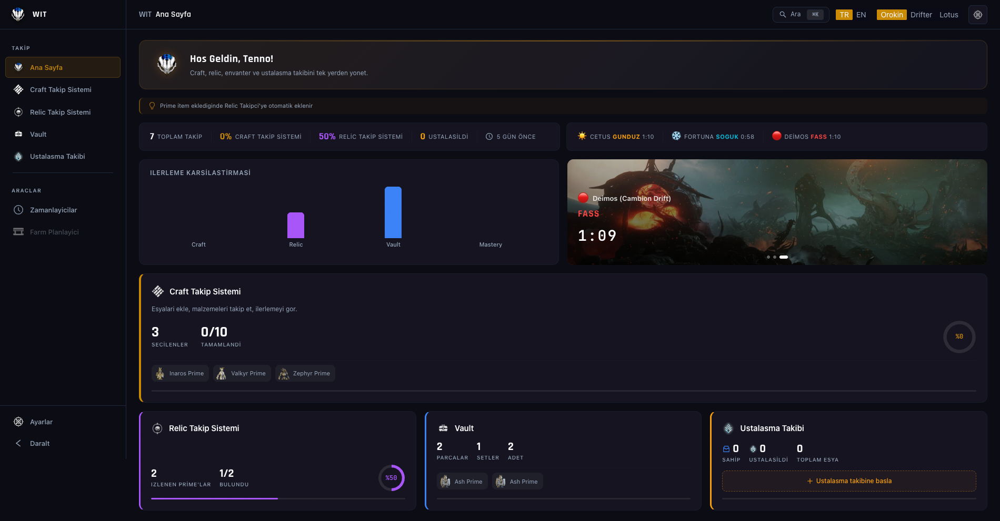

# Warframe Item Tracker

**Современный, с поддержкой тем, PWA-трекер для крафта Warframe, Void-реликвий, Prime-инвентаря, прогресса Mastery, таймеров открытого мира и Amp Оператора.**

[🇬🇧 English](../README.md) · [🇹🇷 Türkçe](./README.tr.md) · [🇩🇪 Deutsch](./README.de.md) · [🇫🇷 Français](./README.fr.md) · [🇪🇸 Español](./README.es.md) · [🇮🇹 Italiano](./README.it.md) · [🇵🇹 Português](./README.pt.md) · [🇷🇺 Русский](./README.ru.md) · [🇯🇵 日本語](./README.ja.md) · [🇸🇦 العربية](./README.ar.md)

  

---

## Обзор

**WIT (Warframe Item Tracker)** — приложение-компаньон для Warframe, помогающее управлять крафтом, Void-реликвиями, Prime-инвентарём, mastery, циклами открытого мира и Amp Оператора — всё в одном месте, без аккаунта. Устанавливается как **Progressive Web App (PWA)**, работает офлайн после первой загрузки. Все данные хранятся в localStorage. Без телеметрии, без регистрации.

---

## Возможности

- **Панель** — Обзор всех трекеров с графиками и живыми таймерами
- **Craft Tracker** — Добавляйте предметы, смотрите ресурсы, сортируйте перетаскиванием
- **Relic Tracker** — Какие реликвии дают какие Prime-части, двусторонняя синхронизация
- **Хранилище** — Управляйте Prime-частями, смотрите какие сеты можете собрать
- **Mastery Tracker** — 820+ предметов с переключателем из 3 состояний (в наличии / освоено / нет)
- **World Timers** — Обратный отсчёт для Cetus, Fortuna, Deimos + Baro Ki'Teer
- **Amp-система** — Amp-builder, трекер частей, планировщик Eidolon, Meta-сеты
- **10 языков** — Русский, английский, турецкий, немецкий, французский, испанский, итальянский, португальский, японский, арабский
- **3 темы + редактор** — Orokin (золотая), Drifter (зелёная), Lotus (светлая) с динамическими курсорами
- **Активности** — Fissures, Invasions, Nightwave, Sortie, Archon Hunt, Arbitration в прямой ленте на одном экране, обновление каждые 60s
- **Чеклист** — Ежедневные/еженедельные задачи Warframe с автоматическим сбросом в UTC 00:00 и пакетом пресетов
- **Поделиться URL** — Делись данными трекера как DEFLATE-сжатая ссылка, без бэкенда
- **Farm Planner** — ищи ресурсы, задавай цель, смотри места дропа и находи общие фарм-локации для нескольких ресурсов
- **Облачная синхронизация** — твои данные автоматически синхронизируются между всеми устройствами через Supabase (анонимный аккаунт, Realtime cross-device)
- **Экспорт скриншота** — экспорт текущего вида в PNG одним кликом (html-to-image)
- **PWA** — Устанавливается как desktop/mobile-приложение, работает офлайн

---

## Быстрый старт

Требуется: [Node.js 18+](https://nodejs.org)

- Windows: двойной клик на `start.bat`
- macOS / Linux: `./start.sh`

Затем откройте **http://localhost:3444** в браузере.

---

## Подробнее

Полная документация (tech stack, горячие клавиши, структура, скрипты, устранение неполадок): [🇬🇧 README.md](./README.md)

---

## Лицензия

Это **fan-made**-приложение не спонсируется и не одобряется Digital Extremes. Warframe, логотип Warframe и связанные товарные знаки принадлежат [Digital Extremes Ltd.](https://www.digitalextremes.com/). Данные предметов от [WFCD](https://github.com/WFCD). Исходный код свободен для личного использования.

---

**Создано [Suatcan Yasan](https://github.com/SuatcanYasan)**

[⬆ Наверх](#warframe-item-tracker)

